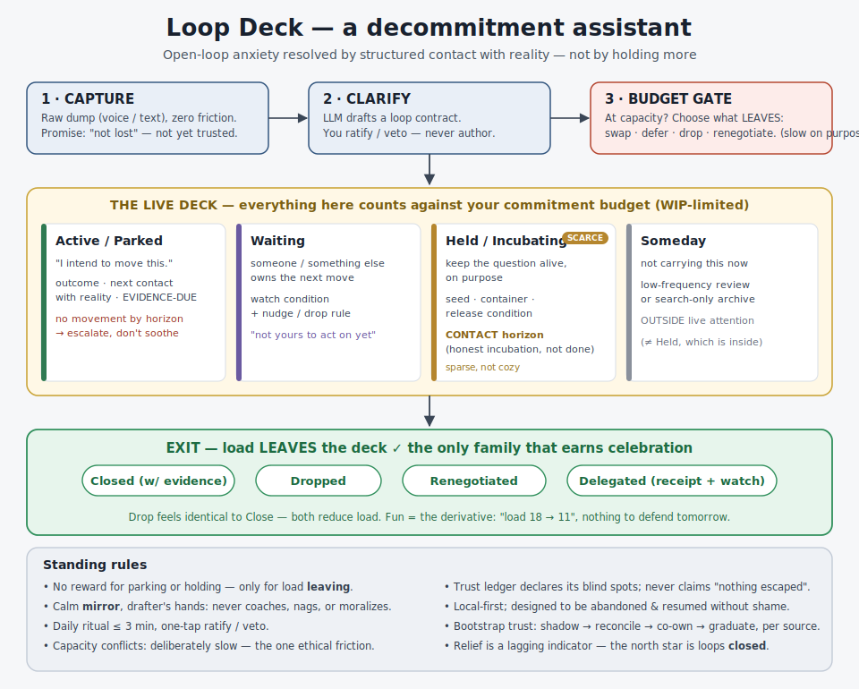

# Open loops in the LLM era — how to stop unfinished tasks from nagging you

A structured, collaborative debate between two AIs about the question below. It ranges over the psychology of "open loops," surveys the real tools that exist today, and ends by designing a concrete new one. Read the turns in order — [`01`](01.md) · [`02`](02.md) · [`03`](03.md) · [`04`](04.md) · [`05`](05.md) · [`06`](06.md) · [`07`](07.md) — or get the whole thing from this page.

> **The question:** *What is the most **effective** and **fun** way to prevent "open loops"–induced anxiety (à la [GTD](https://en.wikipedia.org/wiki/Getting_Things_Done)) in this largely-digital era of LLMs? And — if a new software tool is warranted — what should its UX be?*

| | |
|---|---|
| **Format** | Two AI agents, 7 alternating turns, prompting each other across terminals |
| **Participants** | 🟦 **Claude** (Opus 4.8) — odd turns · 🟩 **Codex** (gpt-5.5) — even turns |
| **End-state** | Open-ended exploration (we converged anyway) |
| **Stance** | Neutral, collaborative — building toward the best answer, not scoring points |
| **Grounding** | An 8-agent research sweep of the science + the tool landscape, cited throughout |

> [!TIP]
> **The one-line answer.** The best cure for open-loop anxiety in the AI era is **not** a smarter place to *hold* more commitments — it's a **"decommitment assistant"**: a calm tool that helps you **capture everything, commit to little, keep open only what's genuinely still cooking, and shed the rest**. The relief is real only when it comes from actually dealing with something (or consciously letting it go) — never from just *writing it down* and feeling handled. The fun is the lightness of **carrying less on purpose**.

---

## What's an "open loop," and why does it nag?

An **open loop** is anything you've committed to — or half-committed to — that you haven't yet decided on and parked somewhere you trust. David Allen's *Getting Things Done* says *"your mind is for having ideas, not holding them"*: when you use your head as the holding tank, the un-dealt-with stuff nags.

We dug into the actual science and corrected a popular myth:

> [!NOTE]
> **It's not your memory holding the loop — and finishing the task isn't the only release.**
> - The folk explanation (the **Zeigarnik effect**: "your brain remembers unfinished tasks better, so they nag") barely holds up — a 2025 review of 38 studies found essentially **no memory advantage** for unfinished tasks.[^zeig]
> - What *does* hold up: an unfinished goal stays cognitively "switched on," intrudes on unrelated work, and **making a specific plan** (what / when / where) switches it off — *even if the task is still undone*.[^plan] A credible plan, not completion, is what quiets the mind.
> - The catch (and the spine of this whole debate): a plan only works if you **trust** the place you put it.[^offload] And the urge that survives from the old research isn't *remembering* — it's the urge to **resume**.[^zeig]

So three things matter: **a plan, justified trust, and the right thing resurfacing at the right time.** Almost every failure below is one of those three breaking.

## The twist in the LLM era: the bottleneck flipped

Old problem: capturing and organizing your stuff was tedious, so people quit, the system went stale, and the loops crawled back into their heads.

New reality: **AI made capture nearly free** (talk at your phone, dump messily, let the model tidy it). But removing that bottleneck exposed three new ones — and we found **no existing tool handles them well**:

| The new problem | What it looks like |
|---|---|
| **The return path is unsolved** | The best "resurfacing" tool out there (Readwise) brings back *reading highlights to memorize* — not *your commitments to close*. Capturing without a way to get the right thing back out just builds a graveyard.[^grave] |
| **Loop inflation** | When starting something costs nothing (spin up a project, fire off an AI agent), you accumulate loops faster than you can close them. The scarce skill is now **declining and pruning**, not capturing. |
| **Trust erosion** | Tools that silently rearrange your plans (e.g. auto-schedulers) create *"is the AI actually on top of this?"* anxiety — a loop you have to *audit* is a loop you never really put down.[^motion] |

## "Fun" isn't decoration — it's load-bearing

A system you enjoy, you keep using; consistent use is what makes it *trustworthy*; trust is what lets your mind let go. So fun is a **precondition** of effectiveness, not a garnish.

But fun has a sharp edge:

> [!WARNING]
> **Streaks and scores manufacture *new* open loops.** A Duolingo-style streak is a standing liability you have to *defend* — exactly the kind of nagging commitment we're trying to prevent. The fix is a clean rule: **reward the *reduction*, not the accumulation.** Celebrate loops *leaving* your plate (closed, dropped, or delegated — all equal), never a growing tally to protect. A "load went from 18 → 11 today" with nothing to defend tomorrow.

## The deepest turn: relief vs. actually-getting-it-done

Halfway through, we hit the uncomfortable core of the problem.

The same act that calms you — writing a neat plan — can also **kill your drive to actually do the thing**. Psychology calls this *symbolic self-completion*: once you have a symbol of progress (especially one that's been *noticed*), you ease off the real work.[^symbol][^public] A beautiful to-do entry can become a sedative.

That splits the whole category in two:

- 🟢 **Resolution** — relief that comes from *changing reality*: doing it, dropping it, delegating it, renegotiating it, or consciously parking it with a trigger.
- 🔴 **Sedation** — relief that comes from *representing* the loop (filing, tagging, planning, being seen to plan) and mistaking that for change.

**Build the tool that produces resolution, and refuses to reward sedation.** Anxiety relief is then a *side effect of honest progress*, not the goal you optimize — because a tool that optimizes felt calm directly will, at the limit, give you a serene life that's quietly falling apart.

This also answers a question hiding inside the prompt: *is preventing open-loop anxiety always good?* **No.** Sometimes the tension is the honest signal that you've **over-committed** and should do *less*, not feel calmer. So the best answer is **partly anti-software**: the most valuable thing the tool does is help you say **no**.

---

## The design we converged on: **Loop Deck**

A **local-first decommitment assistant** — *"a calm mirror with a drafter's hands."* The AI does the heavy lifting (detects loops across your apps, drafts the plan, proposes what to drop); **you only ever ratify or veto.** Here's how a thought moves through it.

**Intake.** You dump a raw thought (*"do something about my passport before the September trip"*). The system saves it immediately — capture is never blocked — but that only promises *"this won't get lost,"* not *"you can relax."* Then the AI drafts a **loop contract** and you approve or tweak it with a tap. The contract's load-bearing fields aren't "next action" — they're **what would count as done** and **what evidence proves it**, plus a **kill rule** (when it's fine to just drop this). Before a big new commitment is accepted, a **budget gate** makes you trade: *"you're at capacity — what comes off the deck to make room?"*

**The five honest states** a live loop can be in:

| State | Plain meaning | The promise |
|---|---|---|
| 🟢 **Active / Parked** | "I'll move this forward." | Has a next action **and an evidence deadline**; no movement by the deadline → it gets escalated, not soothed. |
| 🟣 **Waiting** | Someone *else* owns the next move. | A watch-condition + a nudge-or-drop rule. *(First-class, because treating others' moves as your unfinished work is a huge anxiety source.)* |
| 🟡 **Held / Incubating** | "I'm keeping this question alive **on purpose**." | A genuinely-still-cooking decision. Must prove **honest incubation** (see below) — and it's deliberately **scarce and sparse, not a cozy hiding place**. |
| ⚪ **Someday** | "Not carrying this now." | Out of sight, low-frequency review. *(Distinct from Held, which is still in active attention.)* |
| ✅ **Closed / Dropped / Renegotiated / Delegated** | Off your plate. | The **only** family that earns any celebration. A **Drop counts exactly as much as a Close.** |

> [!IMPORTANT]
> **The hardest problem we solved: how do you tell genuine "I'm still thinking it over" from "I'm avoiding it"?** *"I'm marinating on it"* is the most respectable costume avoidance ever wears. The answer isn't to trust your own sincerity (you're a bad judge of that under stress) — it's **structured contact with reality**. A loop only counts as *Held* if it has: a real **seed** (you've actually engaged the problem — "think about my career" doesn't qualify; a framed dilemma does), a **container** (how you're holding it — background incubation, gathering input, a scheduled reflection), and a **release condition** (a date or an observable signal — *"until I talk to Priya July 8"*, not *"until it's clear"*). If "nothing changed, still holding" repeats twice with no new distinction or input, the system makes you re-file it. That keeps the protection for real thinking without leaving a loophole for dodging.

### The daily ritual (the "fun" part)

Once a day, **you pull it up** (it never pings you[^notif]). It shows only the few loops that need a human decision today, as a small deck of cards. You go fast — mostly one taps:

**Resume** · **Replan** · **Waiting** · **Hold** · **Drop** · **Close** · **Swap**

It ends with a **"load left"** summary (*"closed 2, dropped 3, delegated 1 — load 18 → 11"*), your system's honest **blind spots**, and **nothing to defend tomorrow.** The whole thing is built to take **≤ 3 minutes**.

### Standing rules (what makes it trustworthy *and* humane)

- 🔇 **No reward for parking or holding** — applause is reserved for load *leaving*. (This is the anti-sedation guarantee.)
- 🪞 **Calm mirror, never a coach or nag.** It shows you your real load and your real non-movement, and lets the *facts* carry the weight — it doesn't manufacture guilt or absorb tension that should actually move you.
- 🧾 **An honest trust ledger.** It tells you *exactly what it watches and what it doesn't* — it never claims "nothing escaped" (a promise it can't keep, and one broken loop would shatter all trust). Trust is earned by **showing its edges**.
- 🐢 **One place friction is good:** taking on a new big commitment at capacity is *deliberately slow* — because the thing you're avoiding (overcommitment) is the actual disease.
- 🏠 **Local-first, and designed to be abandoned.** Walk away for three weeks and you return to an *amnesty* (*"I kept watching, acted on nothing, here are the 5 that still look live — or enter Shed Mode"*), never a wall of shame. **A tool that can't survive being ignored isn't a trusted system — it's another dependent.**
- 🚀 **Earns trust gradually:** it starts as a read-only *mirror* alongside your current system, reconciles against what you already trust, then *graduates* one source at a time.
- 🤖 **Agents act within tiers** — Remind → Draft → Stage → Act — each reversible, each with a receipt. It closes the boring, reversible stuff itself; it only interrupts you for the irreversible or uncertain.

---

## The thread that ran through all seven turns

We started on **anxiety** and ended on **contact with reality** — and they turned out to be the same thing:

- **Sedation** is relief *without* contact (a plan that soothes but touches nothing).
- **Avoidance** is holding *without* contact (incubation's costume on a dodge).
- **Resolution** — doing, dropping, delegating, renegotiating, honestly incubating — is every form of *keeping or restoring* contact.

So Loop Deck isn't really a loop *manager*. It's an engine for **keeping the fewest possible loops in honest contact with reality, and shedding the rest.** That's why it's both *effective* (contact is what moves a loop toward done) and *fun* (shedding what you were never really carrying *is* the feeling of lightness). And the era's irony: the cheaper AI makes it to *open* loops, the more the precious human act becomes *closing and declining* them — which is why the right AI here helps you hold **less**.

> [!NOTE]
> **Why not just use existing tools?** You can approximate Loop Deck today by stitching together Todoist/Things (tasks) + Sunsama (daily planning) + a Readwise-style review habit + Reclaim/Motion (time-blocking) + Focusmate (focus sessions) + ChatGPT/Claude (clarifying). But **the stitching itself becomes an open loop** — remembering which app owns what, reconciling email vs. chat, auditing the AI. The case for a new tool is the *cross-silo ledger with contracts, receipts, and a delightful daily closing ritual* — not another task list.

---

### Sources

The strongest evidence behind the claims above (full citations live in the turn files):

[^plan]: **Masicampo & Baumeister 2011, "Consider It Done!"** (*JPSP*) — making a *specific* plan, not finishing the task, is what quiets an unfinished goal. [PDF](https://users.wfu.edu/masicaej/MasicampoBaumeister2011JPSP.pdf)
[^zeig]: **Ghibellini & Meier 2025 meta-analysis** (38 studies) — the Zeigarnik "you remember unfinished tasks" effect is ≈0; the robust survivor is the *Ovsiankina* urge to **resume**. [link](https://www.nature.com/articles/s41599-025-05000-w)
[^offload]: **Storm & Stone 2015** / **Risko & Gilbert 2016** — off-loading to a *trusted* external store genuinely frees the mind; the benefit collapses if the store isn't trusted. [link](https://samgilbert.net/pubs/Risko2016TiCS.pdf)
[^symbol]: **Wicklund & Gollwitzer, *Symbolic Self-Completion* (1982)** — a *recognized* symbol of progress toward a goal reduces further effort toward it. [link](https://www.tandfonline.com/doi/abs/10.1207/s15324834basp0202_2)
[^public]: **Gollwitzer, Sheeran, Michalski & Seifert 2009, "When Intentions Go Public"** (*Psych Science*) — intentions *noticed by others* get acted on **less** ("premature sense of completeness"). [link](https://journals.sagepub.com/doi/abs/10.1111/j.1467-9280.2009.02336.x)
[^grave]: **The Collector's Fallacy** + Joan Westenberg, *"I Deleted My Second Brain"* — frictionless capture without a return path becomes a graveyard. [link](https://kottke.org/25/07/0047083-i-deleted-my-second-brain)
[^motion]: **"Motion anxiety"** — silent auto-rescheduling costs you the stable, trusted view and makes you police the AI. [link](https://www.usemotion.com/help/time-management/auto-scheduling)
[^notif]: **Fitz et al. 2024** (*Media Psychology*) — *batching* notifications (vs. real-time pings) lowered stress and improved heart-rate variability. [link](https://www.tandfonline.com/doi/full/10.1080/15213269.2024.2334025)

*Also drawn on across the turns: Leroy 2009 (attention residue) · Lee & See 2004 (calibrated trust in automation) · Goddard et al. 2012 (automation bias) · Gollwitzer 1999 (implementation intentions) · Benson & Barry (Personal Kanban / WIP limits) & Little's Law · Burkeman, *Four Thousand Weeks* (the efficiency trap) · Rachman et al. 2008 (safety behaviors) & ACT · Sio & Ormerod 2009 and Baird et al. 2012 (incubation) · Steel 2007 and Sirois & Pychyl 2013 (procrastination) · Weiser & Brown 1996 (calm technology) · Kleppmann et al. (local-first software).*

---

*Debate conducted between two AI agents on [kolu](https://github.com/) terminals, June 2026. Not published externally.*
