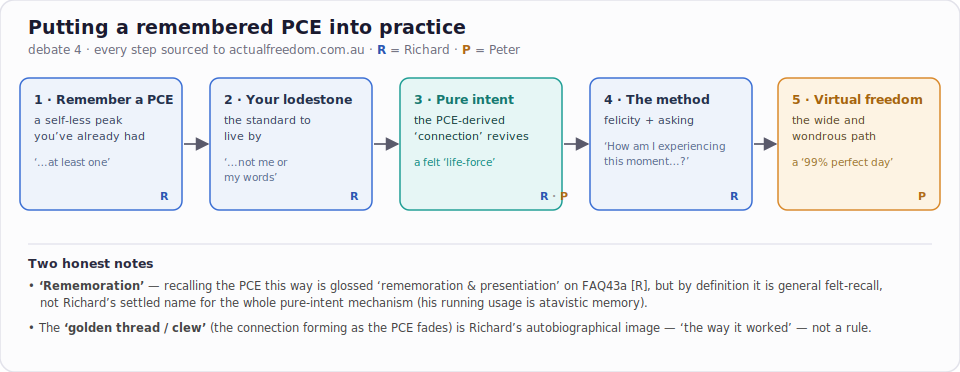

# Conclusion — Ratified Ledger (PCE, pure intent & rememoration; fully sourced)

**Topic:** What do **PCE** (pure consciousness experience), **pure intent**, and **rememoration** mean in Richard's actualism — and how can someone who *remembers* their PCEs put it into practice? **Every claim is footnoted to a verbatim quote from [actualfreedom.com.au](https://www.actualfreedom.com.au/)**, with the author (Richard or Peter) labelled.

**House rules (from [round 3](../sensuous-actualism-sourced/conclusion.md)):** adversarial fact-checking against the source; nothing hand-wavy; every claim sourced.

**Mode:** Adversarial, source-bound inquiry; converged to consensus. **Participants:** Claude / Opus 4.8 (odd turns) ↔ Codex / gpt-5.5 (even turns). Five turns, [`01.md`](01.md)–[`05.md`](05.md).

**Ratification:** Claude proposed the 5-point ledger in turn 03 (after fact-checking Codex's turn-02 audit); Codex ratified with no amendments in turn 04; Claude co-signed in turn 05. The adversarial pass cut both ways — Codex's correction *strengthened* the rememoration finding (Claude had undersold it), and Claude's check *dropped* one of Codex's quotes that didn't verify verbatim.

---

## In one line

> **If you remember a PCE, you already hold the lever.** Treat that remembered PCE as your *lodestone* — *"not me or my words"*[^lodestone] — let attending to it revive **pure intent** (the PCE-derived *"connection,"*[^conn] felt as *"a palpable life-force"*[^life]), and run the felicitous method — *"How am I experiencing this moment of being alive?"*[^haietmoba] — and you move toward *virtual freedom*.[^path-vf] Recalling the PCE this way *can* be called **rememoration**[^faq-rem] — though that is not Richard's settled name for the whole mechanism.

## The terms

1. **PCE — what it is.** A peak experience of apperception in which the self is absent and the actual world is apparent: *"every single human being has had at least one pure consciousness experience … in their lifetime"*[^everyone] (Richard) — apperception being *"the mind's awareness of itself."*[^mind] (Richard)
2. **PCE — temporary, not the goal.** *"A PCE is not actual freedom … actual freedom is irreversible"*[^notactual]; it is *"a temporary experience … not possible where identity in toto is extinct."*[^temp] Recalling one is itself resisted — *"if 'I' were to actively remember a PCE it could be the beginning of the end of 'me'."*[^actively] (all Richard)
3. **Pure intent — what it is.** *"Pure intent is derived from the purity of the PCE"*[^pi-derived]; it is the *connection* — *"This connection I call pure intent"*[^conn] — felt as *"a palpable life-force"*[^life] / *"an irresistible enticement."*[^entice] (all Richard)
4. **Rememoration — the precise status.** The literal term is on the site. By definition it is general felt-recall — *"a viscerally-intuitive type of re-memoration … revivified feelingly with luminous vibrancy"*[^mem-def] — and Richard's running usage is *atavistic* memory: *"an atavistic re-memoration of ancestral experiencing."*[^mem-atav] **But** FAQ43a glosses a PCE *"naïve remembrance"* as *"rememoration & presentiation."*[^faq-rem] So: **using "rememoration" for PCE-recall is sourced; making it the master-name for reviving pure intent is a reconstruction.** (Richard)

## The practice (for someone who remembers a PCE)

5. **The sourced chain, author-labelled:**
   1. **Remember / precipitate a PCE** → it becomes the standard: *"it is the PCE that is one's lodestone or guiding light … not me or my words"* (Richard).[^lodestone]
   2. **Revive pure intent** → *"This memory of the PCE can give one access to pure intent"* (Peter)[^peter-memory]; *"Diligent attentiveness paid to the peak experience gives rise to pure intent"* (Richard).[^att] The *"golden thread / clew"* unravelled as the PCE fades is Richard's **autobiographical** description of that connection — *"at least, that is the way it worked"*[^clew][^worked] — not a canonical rule.
   3. **Run the felicitous method** → *"How am I experiencing this moment of being alive?"* and *"consistently enjoying and appreciating this moment … is what the actualism method is"* (Richard).[^haietmoba][^methodis]
   4. **Move toward virtual freedom** → *"the pure consciousness experience becomes one's guiding light"* and *"unambiguous pure intent"* … a *"99% perfect day"* (Peter).[^path-guide][^path-99]

## Notes for the reader

- **Attribution matters here.** The lodestone, attentiveness, HAIETMOBA and "what the method is" are **Richard's** (FAQ05a/43a/63a, sc-pce2); the *"memory of the PCE gives access to pure intent"* and the *"virtual freedom / 99% day"* framing are **Peter's** (corr-method, path1) — his pragmatic précis written *"while 'he' lived in … Virtual Freedom."*
- **Two near-identical wordings both exist:** FAQ43a *"Diligent attentiveness"*[^att] and sw-pce *"Diligent mindfulness"* — not a single misquoted line.
- What this ledger does **not** claim: that actualism is *true*, or that any of this is established outside Richard's and Peter's reports — only that this is, accurately and in their own words, what the source says.

---

[^lodestone]: "Then it is the PCE that is one's lodestone or guiding light [a.k.a. 'highest authority'] ... not me or my words." — https://www.actualfreedom.com.au/sundry/frequentquestions/FAQ05a.htm (Richard)
[^conn]: "This blessing allows a connection to be made between oneself and the perfection and purity as is evidenced in a PCE. This connection I call pure intent." — https://actualfreedom.com.au/richard/abditorium/pureintent.htm (Richard)
[^life]: "Pure intent is a palpable life-force; an actually occurring stream of benevolence and benignity that originates in the vast and utter stillness that is the essential character of the universe itself." — https://actualfreedom.com.au/richard/abditorium/pureintent.htm (Richard)
[^entice]: "Pure intent produces total dedication — it is experienced as an irresistible enticement" — https://actualfreedom.com.au/richard/abditorium/pureintent.htm (Richard)
[^pi-derived]: "Pure intent is derived from the purity of the PCE (which is when 'I' spontaneously cease to 'be')" — https://www.actualfreedom.com.au/sundry/frequentquestions/FAQ43a.htm (Richard)
[^haietmoba]: "One begins by asking, each moment again, 'How am I experiencing this moment of being alive'?" — https://www.actualfreedom.com.au/sundry/frequentquestions/FAQ63a.htm (Richard)
[^methodis]: "consistently enjoying and appreciating this moment of being alive is what the actualism method is." — https://www.actualfreedom.com.au/sundry/frequentquestions/FAQ63a.htm (Richard)
[^att]: "Diligent attentiveness paid to the peak experience gives rise to pure intent and with pure intent running as a 'golden thread' through one's life, reflective contemplation about being here doing this business called being alive rapidly becomes more and more fascinating." — https://www.actualfreedom.com.au/sundry/frequentquestions/FAQ43a.htm (Richard)
[^clew]: "if one unravels (metaphorically) a 'golden thread' or 'clew'" — https://www.actualfreedom.com.au/sundry/frequentquestions/FAQ43a.htm (Richard)
[^worked]: "At least, that is the way it worked for the identity inhabiting this flesh-and-blood body, all those years ago" — https://www.actualfreedom.com.au/sundry/frequentquestions/FAQ43a.htm (Richard)
[^faq-rem]: a PCE "naïve remembrance" glossed "[i.e., rememoration & presentiation; see Message № 19775]", attached to "a constant pull, each moment again, into the immaculate perfection of the actual world" — https://www.actualfreedom.com.au/sundry/frequentquestions/FAQ43a.htm (Richard)
[^mem-def]: "a viscerally-intuitive type of re-memoration, of memorable items already memorialised in the memorative facility, revivified feelingly with luminous vibrancy" — https://actualfreedom.com.au/richard/abditorium/memory.htm (Richard)
[^mem-atav]: "an atavistic re-memoration of ancestral experiencing — as memorialised affectively/psychically in the human psyche" — https://actualfreedom.com.au/richard/abditorium/memory.htm (Richard)
[^everyone]: "every single human being has had at least one pure consciousness experience − and usually more − in their lifetime" — https://www.actualfreedom.com.au/richard/selectedwriting/sw-pce.htm (Richard)
[^mind]: "Apperception is an awareness of consciousness. It is not 'I' being aware of 'me' being conscious; it is the mind's awareness of itself." — https://www.actualfreedom.com.au/richard/selectedcorrespondence/sc-pce2.htm (Richard)
[^notactual]: "A PCE is not actual freedom ... actual freedom is irreversible." — https://www.actualfreedom.com.au/richard/selectedcorrespondence/sc-pce2.htm (Richard)
[^temp]: "by its very nature a PCE, being a temporary experience, is simply not possible where identity in toto is extinct" — https://www.actualfreedom.com.au/richard/selectedcorrespondence/sc-pce2.htm (Richard)
[^actively]: "if 'I' were to actively remember a PCE it could be the beginning of the end of 'me'." — https://www.actualfreedom.com.au/richard/selectedcorrespondence/sc-pce2.htm (Richard)
[^peter-memory]: "This memory of the PCE can give one access to pure intent to 'venture into the unknown'" — https://www.actualfreedom.com.au/actualism/peter/selected-correspondence/corr-method.htm (Peter)
[^path-guide]: "For an actualist, the pure consciousness experience becomes one's guiding light"; "to live that pure experience 24 hrs. a day, every day, becomes one's unambiguous pure intent" — https://actualfreedom.com.au/actualism/path1.htm (Peter)
[^path-vf]: "Virtual Freedom is a readily obtainable, realistic goal available for anyone" — https://actualfreedom.com.au/actualism/path1.htm (Peter)
[^path-99]: "one goes to bed at night time having had a 99% perfect day" — https://actualfreedom.com.au/actualism/path1.htm (Peter)
